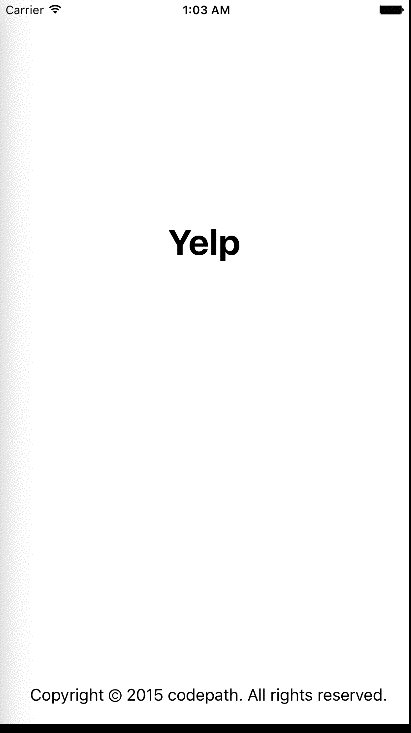

# Yelp Search Applicatoin

Time spent: 15 hours spent in total

Completed user stories:

 * [x] Required: Search results page
 * [x] Required: Filter Page
 
Notes:

Spent some time figuring out auto layout, yelp api (distance in meters wasted a ton of debug time - debugged nearly whole app before realising that detail which was causing no results to load), keeping track of state (especially separate checkmarks in two separate sections), etc.

Walkthrough of all user stories:

